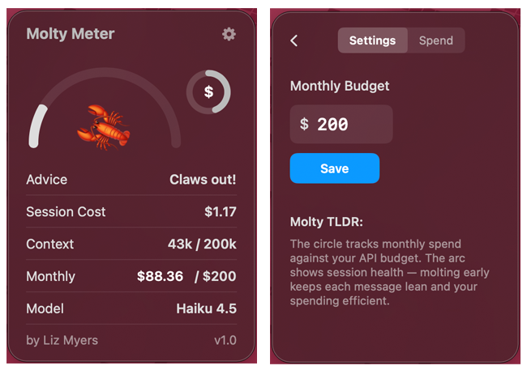

# Molty Meter

A floating macOS desktop widget that monitors AI session health and token spend in real time.

Originally built to monitor Anthropic Claude API spend, but works with any provider supported by [OpenClaw](https://github.com/openclaw).



## What You See

**Two gauges:**
- **Arc** — Session health (context window fill). When Molty says "Time to molt!", your session is getting heavy.
- **Circle** — Monthly budget tracking. The "$" fills as you approach your limit.

## Easy Install

```bash
git clone https://github.com/lizmyers/molty-meter.git
cd molty-meter
swift build
.build/debug/MoltyMeter
```

Set your monthly budget in Settings. Molty watches your OpenClaw sessions automatically.

## Launch the Desktop Widget on Mac OS

Want Molty waiting for you every morning? Add it to your Login Items:

**Option 1: System Settings (easiest)**
1. Open **System Settings → General → Login Items**
2. Click **+** under "Open at Login"
3. Navigate to your MoltyMeter build and select it

**Option 2: LaunchAgent (for CLI fans)**

```bash
# Create the plist
cat > ~/Library/LaunchAgents/com.molty.meter.plist << 'EOF'
<?xml version="1.0" encoding="UTF-8"?>
<!DOCTYPE plist PUBLIC "-//Apple//DTD PLIST 1.0//EN" "http://www.apple.com/DTDs/PropertyList-1.0.dtd">
<plist version="1.0">
<dict>
    <key>Label</key>
    <string>com.molty.meter</string>
    <key>ProgramArguments</key>
    <array>
        <string>/full/path/to/molty-meter/.build/debug/MoltyMeter</string>
    </array>
    <key>RunAtLoad</key>
    <true/>
</dict>
</plist>
EOF

# Load it
launchctl load ~/Library/LaunchAgents/com.molty.meter.plist
```

Replace `/full/path/to/` with your actual path. Molty will be there when you log in.

## The Philosophy

**Session hygiene is budget hygiene.**

Don't wait for auto-compaction. When Molty warns you, wrap up and start fresh. You'll:
- Keep full control of your context
- Avoid surprise summarization
- Send leaner messages
- Spend less per interaction

The arc and circle work together: healthy sessions lead to healthy budgets.

## Requirements

- macOS 13+
- OpenClaw (reads from `~/.openclaw/agents/`)
- An Anthropic API key (and the desire to spend it wisely)

### Adjust health thresholds

Edit `MoltyMeter/SessionHealthState.swift` to tune when Molty warns you:

```swift
static func from(cost: Double, totalTokens: Int) -> SessionHealthState {
    if cost > 5.0 || totalTokens > 1_000_000 { return .heavy }
    if cost > 3.50 || totalTokens > 750_000 { return .warning }
    if cost > 2.0 || totalTokens > 500_000 { return .watching }
    return .healthy
}
```

Lower the thresholds for cheaper models, raise them for expensive ones.

## License

MIT

---

*Built by [Liz Myers](https://github.com/lizmyers/) with help from Claude. Shell yeah!*
